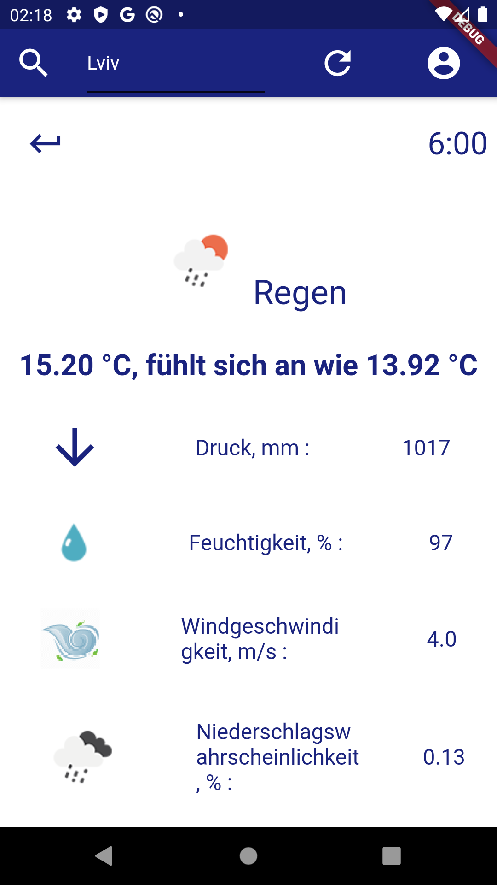

#  Phoenix Weather

# For Users

###

Simple weather app 

# For Developers
### Version: 0.1.4
Please, see packages/phoenixweather_flutter_app for developer details.
#### "Issues"
- Have you added your API keys before using flutter build? No? Then don't say it not works.
- See android [appbundle 0.1.4](https://github.com/bgoncharuck/phoenixweather/releases/tag/0.1.4) in release section
- [Find it on play market](https://play.google.com/store/apps/details?id=com.bgoncharuck.phoenixweather.phoenixweather_flutter_app)

