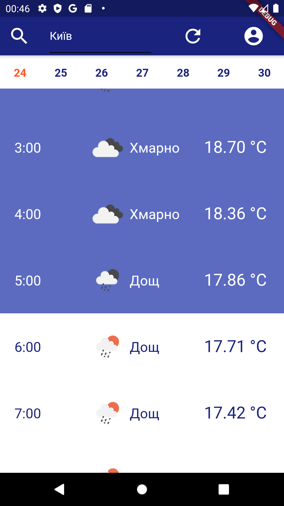
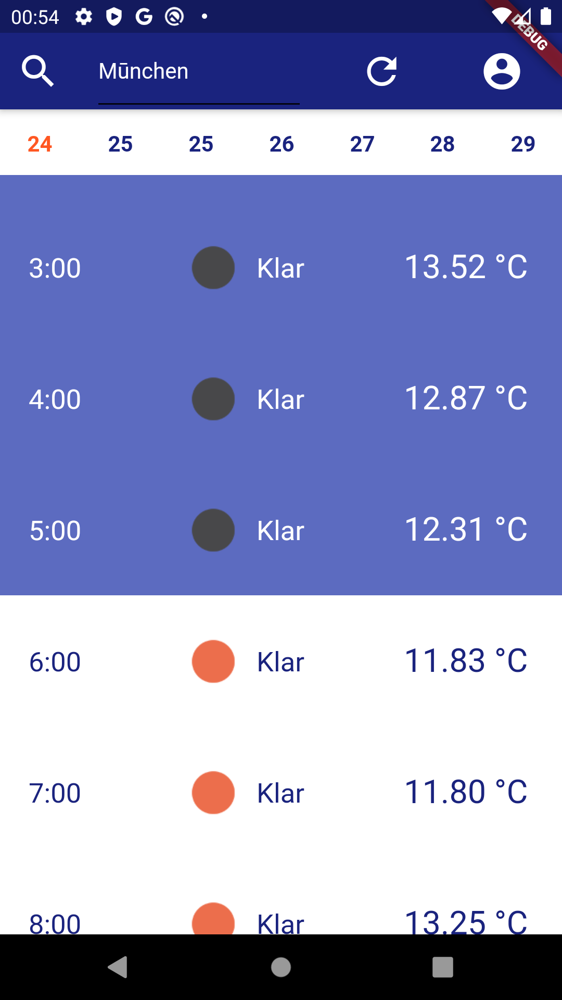
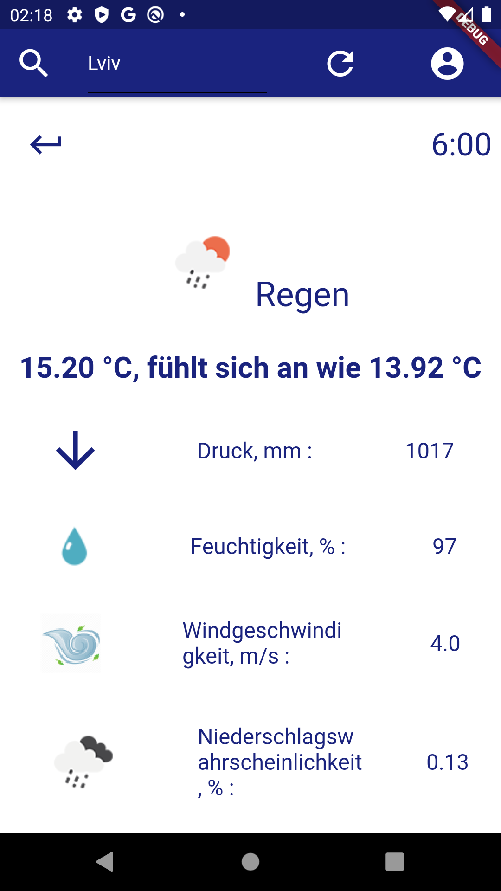

# phoenixweather_flutter_app

Simple weather app with home location sync between devices by Google API.
`and by facebook API when their covoid hysteria finally ends.`

# For Developers
### App structure:
#### It uses 3 BLoCs
1. Loading BLoC used to initialize app, load files from local storage and data firebase. Also, it is used to rebuild app, when new user logins.
2. Search BLoC from common dart package `../phoenixweather_bloc_common` , used to make event of Search of new location/weather or update weather for this location. It also writes data to runtime database and storage if they was provided.
3. Show BLoC from dart package `../phoenixweather_bloc_common` used to show data, on events SearchStateSuccess and SearchStatePrevious. It has two states: show_items and show_item. show_items will show weather hourly/daily for 7 days (first 2 days/48 hours are detailed by 1 hour per item). show_item used to show detailed information on hour or daytime.

#### It has services:
- permissions, to solve permissions checks
- loadlocalfiles and writelocalfiles, to save/load 2-3 json files with local information, depending on network avaibility.
- firebase_load and firebase_add needed for sync locations data between all users for faster search and failure-proove for Google Coding API.
- firebase_user has methods to deal with map of user home locations and firebase_auth used to work under login providers like GoogleSignIn, FacebookLogin or GithubAPI to switch yhe user account.

#### It can use custom themes and languages
by implementing `lib/theme/language.dart` and `/lib/theme/style.dart` interfaces.

#### It is stable
No memory leaks or overloads thanks to BLoC and visitor patterns.

#### All code is modular and protected by either GPLv3 or LGPLv3
You can change it in any way you want while saving copyleft license.

Don't forget to include your API keys in ../packages/phoenixweather_common/lib/src/private/key.